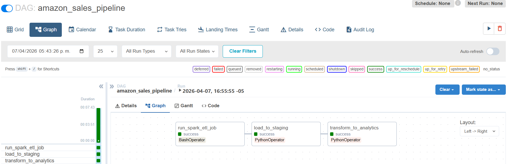
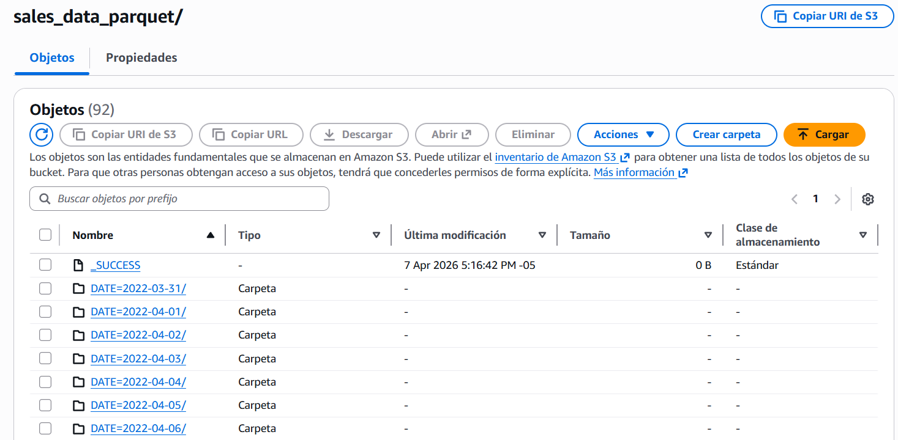
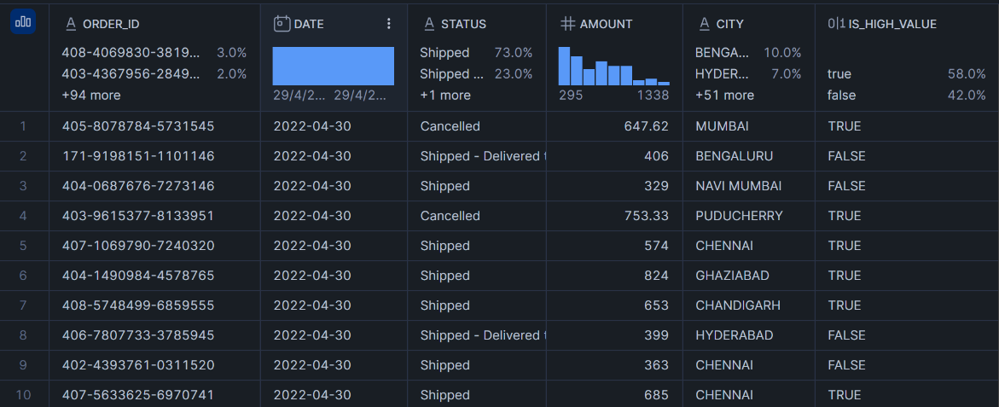

# Amazon Sales Data Pipeline (End-to-End) 

This project implements a professional end-to-end Data Engineering pipeline using a modern tech stack and industry best practices.

## Key Features
- End-to-End Data Pipeline (Batch Processing)
- Medallion Architecture (Bronze → Silver → Gold)
- Distributed processing with Apache Spark
- Partitioned Parquet datasets in S3
- Automated orchestration with Apache Airflow
- Scalable ingestion using Snowflake COPY INTO
- Feature engineering for business insights

## System Architecture
The data flow follows the **Medallion Architecture** (Bronze, Silver, Gold) to ensure data quality, reliability, and traceability:

1.  **S3 (Data Lake):** Storage for Raw CSV landing files.
2.  **Apache Spark (ETL):** Distributed processing for data cleaning, type casting, and schema enforcement.
3.  **S3 (Processed):** Intermediate storage using partitioned **Parquet** files for optimized performance.
4.  **Snowflake (DWH):** Data ingestion into the **STAGING** layer and final transformation into the **ANALYTICS** layer.
5.  **Airflow (Orchestration):** Workflow management, task monitoring, and automated retries.

---

## Tech Stack
* **Orchestration:** Apache Airflow
* **Processing Engine:** Apache Spark (PySpark)
* **Cloud Storage:** Amazon S3
* **Data Warehouse:** Snowflake
* **Infrastructure:** Docker & Docker Compose
* **Language:** Python 3.8

---

## Pipeline Overview

### 1. Data Ingestion
Original sales data (CSV) is stored in an S3 bucket (Raw layer).

### 2. Transformation with Spark
A robust ETL process is executed to handle:
* Handling missing values and data cleaning.
* Schema enforcement (Date and Numeric type casting).
* **Feature Engineering:** Added a business logic column `IS_HIGH_VALUE` for transactions exceeding $500.
* **Storage Optimization:** Writing the final dataset in **Parquet** format.

### 3. Loading & Modeling (Snowflake)
* Leveraged `COPY INTO` with `MATCH_BY_COLUMN_NAME` for efficient, schema-aware ingestion.
* Strict separation of concerns between `STAGING` (technical ingestion) and `ANALYTICS` (business-ready data).

---

## Workflow (Airflow DAG)
The DAG coordinates the sequence of tasks:
`Spark_ETL` >> `Load_to_Staging` >> `Transform_to_Analytics` >> `Data_Quality_Check`

### Execution Evidence

#### 1. Airflow DAG Success


#### 2. S3 Data Structure (Parquet)
The image shows the processed layer in S3, where data is partitioned by date in Parquet format to optimize query performance and reduce scanning costs.



#### 3. Transformed Data in Snowflake


---
## How to Run the Project


### Prerequisites

Make sure you have installed:

- Docker
- Docker Compose
- Git
- Snowflake account
- AWS account (S3 bucket configured)

---

### 1. Clone the Repository

```bash
git clone https://github.com/your-username/amazon-sales-etl.git
cd amazon-sales-etl
```
---
### 2. Configure Environment Variables
---
AWS CONFIGURATION
- AWS_ACCESS_KEY_ID=your_access_key
- AWS_SECRET_ACCESS_KEY=your_secret_key
- AWS_REGION=us-east-1

SNOWFLAKE CONFIGURATION
- SNOWFLAKE_ACCOUNT=your_account_id
- SNOWFLAKE_USER=your_username
- SNOWFLAKE_PASSWORD=your_password
- SNOWFLAKE_DATABASE=AMAZON_DB
- SNOWFLAKE_SCHEMA=ANALYTICS
- SNOWFLAKE_WAREHOUSE=COMPUTE_WH

---
### 3. Start the infrastructure
---
- docker-compose up -d

---
### 4. Configure Environment Variables
---
- Open your browser http://localhost:8080

### Default Airflow credentials
- Username: airflow
- Password: airflow

---
### 5. Trigger the pipeline
---

- Search for the DAG: amazon_sales_pipeline
- Enable the DAG (toggle ON)
- Click "Trigger DAG"

---
### 6. Validate Data in Snowflake
---

**Check staging data**
- SELECT COUNT(*) FROM AMAZON_DB.STAGING.STG_SALES_DATA;

**Check final analytics table**
- SELECT COUNT(*) FROM AMAZON_DB.ANALYTICS.SALES_DATA;

**Preview data**
- SELECT * FROM AMAZON_DB.ANALYTICS.SALES_DATA LIMIT 10;

---
### 7. Validate Data in S3
---
- Check processed data
- Make shure files are in Parquet format
- Data is partitioned by DATE
